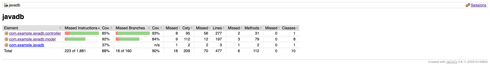

# Community Compass README
This is the GitHub repository for the Community Compass service. If you're looking for the client, please visit: https://github.com/nlin0907/communitycompass-client

#### Team members:
- Nicole Lin, nsl2126
- Preethi Prakash, pp2769
- Divya Tadimeti, dt2760
- Aditi Mutagi, agm2208

## Building and Running a Local Instance
In order to build and use our service you must install the following:

1. Maven 3.9.5: https://maven.apache.org/download.cgi Download and follow the installation instructions, be sure to set the bin as described in Maven's README as a new path variable by editing the system variables if you are on windows or by following the instructions for MacOS.
2. JDK 17: This project used JDK 17 for development so that is what we recommend you use: https://www.oracle.com/java/technologies/javase/jdk17-archive-downloads.html
3. IntelliJ IDE: We recommend using IntelliJ but you are free to use any other IDE that you are comfortable with: https://www.jetbrains.com/idea/download/?section=windows
After you have everything installed, you an clone this repo using <code> git clone https://github.com/preethiprakash1/communitycompass.git </code>
4. If you wish to run the style checker, you can with <code>mvn checkstyle:check</code> or <code>mvn checkstyle:check</code> in the project directory if you wish to generate the report.
5. If you wish to run tests and generate a JaCoCo report, you can with the following commands in the project directory
```
mvn clean test
mvn jacoco:report
open target/site/jacoco/index.html
```
The endpoints are listed below in the "Endpoints" section, with brief descriptions of their parameters.

## Running a Cloud based Instance
You can reach this service in the cloud. To do this, we used Google Cloud, cloned our repository, and ran <code>gcloud app deploy</code>.
1. When running tests in Postman point them to: https://communitycompass-438103.ue.r.appspot.com/<endpoint>
2. To see if the cloud service is still operational please see if the following displays a welcome message: https://communitycompass-438103.ue.r.appspot.com/
3. If the above produced a welcome message "Hi, welcome to Community Compass" then that means the service is operational via the cloud.

## Running Tests
Our unit tests are located under the <code> project/src/test/java/com/example/javadb </code> directory. To run the tests using Java 17, you can run the following commands in the project directory:
```
mvn clean test
mvn jacoco:report
open target/site/jacoco/index.html
```

Note: As discussed with Professor Kaiser during office hours, internal integration tests were not applicable for this project since there is no shared component across different endpoints. However, ExternalIntegrationTests.java provides several happy-path and invalid integration tests that connect the service layer with the real persistent MySQL database.

## API Endpoints
This section describes the endpoints that our service provides, along with their expected inputs and outputs.  It indicates what each endpoint will return upon both success and failure. If the API endpoint structure does not match what you are attempting to send you will receive HTTP 400 NOT FOUND in response.

#### GET /, /index, /home, /welcome
- Expected Input Parameters: N/A
- Expected Output: A welcome message (String)
- Description: Redirects to the homepage. This endpoint should be accessed to view a brief welcome message.
- Upon Success: N/A
- Upon Failure: N/A

#### GET /getCommunityGroups
- Expected Input Parameters: N/A
- Expected Output: A ResponseEntity object containing either the list of community groups or a message indicating no groups were found.
- Description: Retrieves all community groups from the database.
- Upon Success: HTTP 200 Status Code is returned with the list of community groups in the response body.
- Upon Failure: HTTP 404 Status Code with "No Community Groups Found" if no groups are available.

#### GET /getCommunityGroup
- Expected Input Parameters:
  - id (int): The ID of the community group.
  - attribute (String, optional): The specific attribute of the community group to retrieve.
- Expected Output: A ResponseEntity object containing either the full community group details or the value of the requested attribute.
- Description: Returns either the details of the specified community group or a specific attribute if provided.
- Upon Success: HTTP 200 Status Code is returned with the community group details or the requested attribute.
- Upon Failure:
  - HTTP 404 Status Code with "Community Group Not Found" if the group does not exist.
  - HTTP 404 Status Code with "Attribute Not Found" if the provided attribute does not exist.

#### GET /getCommunityGroupsByType
- Expected Input Parameters: type (String): The type of the community group (MENTAL_HEALTH, EMPLOYMENT_ASSISTANCE, OTHER).
- Expected Output: A ResponseEntity containing a list of community groups of the specified type.
- Description: Retrieves all community groups of the specified type from the database.
- Upon Success: HTTP 200 Status Code with the list of community groups of the specified type.
- Upon Failure: HTTP 404 Status Code with the message "No community groups were found for type: {communityType}" if no community groups exist for the specified type.

#### GET /getClosestCommunityGroup
- Expected Input Parameters:
  - type (String): The type of the community group (MENTAL_HEALTH, EMPLOYMENT_ASSISTANCE, OTHER).
  - latitude (double): The latitude of the user's location.
  - longitude (double): The longitude of the user's location.
- Expected Output: A ResponseEntity containing the details of the closest community group of the specified type.
- Description: Finds and returns the community group of the specified type that is closest to the user's location based on Euclidean distance.
- Upon Success: HTTP 200 Status Code with the details of the closest community group.
- Upon Failure: HTTP 404 Status Code with the message "No community groups were found for type: {communityType}" if no community groups exist for the specified type.

#### POST /createCommunityGroup
- Expected Input Parameters: communityName (String), communityType (String), latitude (double), longitude (double), capacity (int), description (String)
- Expected Output: A ResponseEntity object indicating the success or failure of the creation.
- Description: Creates a new community group with the provided information.
- Upon Success: HTTP 201 Status Code is returned along with the details of the newly created group.
- Upon Failure: HTTP 400 Status Code with "Invalid community type provided" if the type is invalid.

#### PATCH /updateCommunityGroup
- Expected Input Parameters: 
  - id (int): The ID of the community group
  - attribute (String): The attribute to update.
  - value (String): The new value for the specified attribute.
- Expected Output: A ResponseEntity object confirming the successful update or failure.
- Description: Updates the specified attribute of the community group.
- Upon Success: HTTP 200 Status Code with the updated community group details.
- Upon Failure:
  - HTTP 404 Status Code with "Community Group Not Found" if the group does not exist.
  - HTTP 404 Status Code with "Attribute Not Found" if the attribute is invalid.

#### DELETE /deleteCommunityGroup
- Expected Input Parameters: id (int): The ID of the community group.
- Expected Output: A ResponseEntity object indicating the result of the deletion operation.
- Description: Deletes the specified community group.
- Upon Success: HTTP 200 Status Code with "Community Group Deleted Successfully".
- Upon Failure: HTTP 404 Status Code with "Community Group Not Found" if the group does not exist.

#### GET /getUsers
- Expected Input Parameters: N/A
- Expected Output: A ResponseEntity object containing a list of users or a message indicating no users were found.
- Description: Retrieves all users from the database.
- Upon Success: HTTP 200 Status Code with the list of users.
- Upon Failure: HTTP 404 Status Code with "No Users Found" if there are no users in the system.

#### GET /getUser
- Expected Input Parameters:
  - id (int): The ID of the user.
  - attribute (String, optional): The specific attribute of the user to retrieve.
- Expected Output: A ResponseEntity object containing either the full user details or the value of the requested attribute.
- Description: Returns the details of the specified user or a specific attribute if requested.
- Upon Success: HTTP 200 Status Code with the user details or the requested attribute.
-  Upon Failure:
  - HTTP 404 Status Code with "User Not Found" if the user does not exist.
  - HTTP 404 Status Code with "Attribute Not Found" if the provided attribute does not exist.

#### POST /createUser
- Expected Input Parameters: name (String), email (String), age (int), sex (String), latitude (double), longitude (double)
- Expected Output: A ResponseEntity object indicating the success or failure of the user creation.
- Description: Creates a new user with the provided information.
- Upon Success: HTTP 201 Status Code is returned along with the details of the newly created user.
- Upon Failure: HTTP 400 Status Code if the user data is invalid.

#### PATCH /updateUser
- Expected Input Parameters:
  - id (int): The ID of the user.
  - attribute (String): The attribute to update.
  - value (String): The new value for the specified attribute.
- Expected Output: A ResponseEntity object confirming the successful update or failure.
- Description: Updates the specified attribute of the user.
- Upon Success: HTTP 200 Status Code with the updated user details.
- Upon Failure:
  - HTTP 404 Status Code with "User Not Found" if the user does not exist.
  - HTTP 404 Status Code with "Attribute Not Found" if the attribute is invalid.

#### DELETE /deleteUser
- Expected Input Parameters: id (int): The ID of the user.
- Expected Output: A ResponseEntity object indicating the result of the deletion operation.
- Description: Deletes the specified user.
- Upon Success: HTTP 200 Status Code with "User Deleted Successfully".
- Upon Failure: HTTP 404 Status Code with "User Not Found" if the user does not exist.

#### GET /getAllResources
- Expected Input Parameters: N/A
- Expected Output: A ResponseEntity object containing a list of all resources.
- Description: Retrieves all resources from the database.
- Upon Success: HTTP 200 Status Code is returned with the list of resources.
- Upon Failure: N/A

#### GET /getResourcesByType
- Expected Input Parameters: type (String): The type of the resource (SHELTER, FOOD_BANK, CLINIC, RESTROOM, OTHER).
- Expected Output: A ResponseEntity containing a list of resources of the specified type.
- Description: Retrieves all resources of the specified type.
- Upon Success: HTTP 200 Status Code with the list of resources of the specified type.
- Upon Failure: HTTP 404 Status Code with the message "No resources were found for type: {resourceType}" if no resources exist for the specified type.

#### GET /getClosestResource
- Expected Input Parameters:
  - type (String): The type of the resource (SHELTER, FOOD_BANK, CLINIC, RESTROOM, OTHER).
  - latitude (double): The latitude of the user's location.
  - longitude (double): The longitude of the user's location.
- Expected Output: A ResponseEntity containing the details of the closest resource of the specified type.
- Description: Finds and returns the resource of the specified type that is closest to the user's location based on Euclidean distance.
- Upon Success: HTTP 200 Status Code with the details of the closest resource.
- Upon Failure: HTTP 404 Status Code with the message "No resources were found for type: {resourceType}" if no resources exist for the specified type.

#### GET /getResource
- Expected Input Parameters:
  - id (int): The ID of the resource.
  - attribute (String, optional): The specific attribute of the resource to retrieve.
- Expected Output: A ResponseEntity object containing either the full resource details or the value of the requested attribute.
- Description: Returns the details of the specified resource or a specific attribute if requested.
- Upon Success: HTTP 200 Status Code with the resource details or the requested attribute.
- Upon Failure:
  - HTTP 404 Status Code with "Resource Not Found" if the resource does not exist.
  - HTTP 404 Status Code with "Attribute Not Found" if the attribute is invalid.

#### POST /createResource
- Expected Input Parameters: resourceName (String), resourceType (String), latitude (double), longitude (double),resourceHours (String), description (String)
- Expected Output: A ResponseEntity object indicating the success or failure of the resource creation.
- Description: Creates a new resource with the provided information.
- Upon Success: HTTP 201 Status Code is returned along with the details of the newly created resource.
- Upon Failure: HTTP 400 Status Code with "Invalid resource type provided" if the type is invalid.

#### PATCH /updateResource
- Expected Input Parameters:
  - id (int): The ID of the resource.
  - attribute (String): The attribute to update.
  - value (String): The new value for the specified attribute.
- Expected Output: A ResponseEntity object confirming the successful update or failure.
- Description: Updates the specified attribute of the resource.
- Upon Success: HTTP 200 Status Code with the updated resource details.
- Upon Failure:
  - HTTP 404 Status Code with "Resource Not Found" if the resource does not exist.
  - HTTP 404 Status Code with "Attribute Not Found" if the attribute is invalid.

#### DELETE /deleteResource
- Expected Input Parameters: id (int): The ID of the resource.
- Expected Output: A ResponseEntity object indicating the result of the deletion operation.
- Description: Deletes the specified resource.
- Upon Success: HTTP 200 Status Code with "Resource Deleted Successfully".
- Upon Failure: HTTP 404 Status Code with "Resource Not Found" if the resource does not exist.

#### POST /addUserToCommunity
- Expected Input Parameters:
  - userId (int): The ID of the user.
  - communityId (int): The ID of the community group.
- Expected Output: A ResponseEntity object indicating the success or failure of adding the user to the community.
- Description: Adds a user to the specified community group.
- Upon Success: HTTP 201 Status Code with "User added to community group successfully".
- Upon Failure:
  - HTTP 404 Status Code with "User Not Found" if the user does not exist.
  - HTTP 404 Status Code with "Community Group Not Found" if the community does not exist.
  - HTTP 409 Status Code with "User is already a member of the community group" if the user is already associated with the group.

#### DELETE /removeUserFromCommunity
- Expected Input Parameters:
  - userId (int): The ID of the user.
  - communityId (int): The ID of the community group.
- Expected Output: A ResponseEntity object indicating the success or failure of removing the user from the community.
- Description: Removes a user from the specified community group.
- Upon Success: HTTP 200 Status Code with "User removed from community group successfully".
- Upon Failure:
  - HTTP 404 Status Code with "User Not Found" if the user does not exist.
  - HTTP 404 Status Code with "Community Group Not Found" if the community does not exist.
  - HTTP 404 Status Code with "User is not a member of the community group" if the user is not associated with the group.

## Style Checking Report
We used the tool "checkstyle" to check the style of our code and generate style checking reports. In particular, we used the maven default sun_checks.xml (taken from https://github.com/checkstyle/checkstyle/blob/master/src/main/resources/sun_checks.xml), with a minor change to allow for more than 7 parameters for method or constructor, since there are a few cases where we have 8. The checkstyle.xml file reflects this. You can use the following command inside the project directory to see the report:
```
mvn checkstyle:check
```
You can also see the screenshot below for the most recent Checkstyle Report.


## Branch Coverage Reporting
We used JaCoCo to perform branch analysis in order to see the branch coverage of the relevant code within the code base. You can use the following command inside the project directory to see the report:
```
mvn clean test
mvn jacoco:report
open target/site/jacoco/index.html
```
You can also see the screenshot below for the most recent JaCoCo Report.


## Static Code Analysis
We used PMD to perform static analysis on our codebase, see below for the most recent output.


## Continuous Integration Report
This repository using GitHub Actions to perform continous integration, to view the latest results go to the following link: https://github.com/preethiprakash1/communitycompass/blob/main/.github/workflows/maven.yml

Click on the latest job on the top under "X workflow runs" then Click 'Build Java Project', 'Run Unit, API, & Integration Tests', or 'Generate PMD, Jacoco, and Checkstyle reports' under jobs finally click the drop down next to all the action items to read the logs made during each of their executions.

For convenience, the most recent automatic CI Report (pmd, checkstyle, and jacoco) has been created and is available for view in the 'reports' directory under the appropriately named file.

## Tools Used
This section includes notes on tools and technologies used in building this service.
- Maven Package Manager
- GitHub Actions CI
  - This is enabled via the "Actions" tab on GitHub.
  - Currently, this runs a Maven build to make sure the code builds on the main branch. It also runs unit, API, and integration tests. The CI also generates a folder called 'reports' that contain the most up-to-date html file-type pmd, checkstyle, and jacoco reports.
- Checkstyle
  - We utilize Checkstyle for code quality reporting.
- JUnit
  - JUnit tests get run automatically as part of the CI pipeline.
- JaCoCo
  - JaCoCo is used to generate code coverage reports.
- PMD
  - We used PMD for static analysis with the default ruleset.
- Postman and Curl
  - Postman and curl are used to test the functionality of our APIs.
- Trello
  - Project management tool. You can find our board here: https://trello.com/b/kiaKflOR/powerpandas

